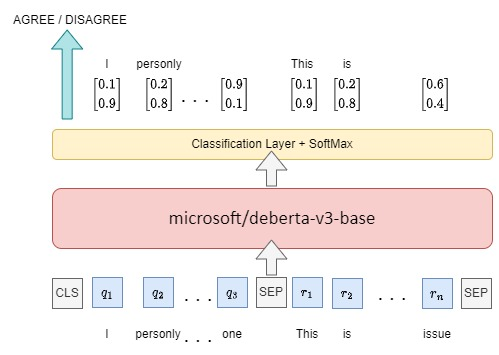
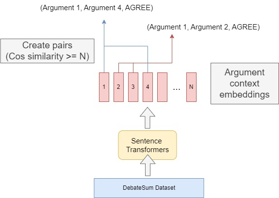

# 自然語言理解的解釋性資訊標記競賽

[比賽連結](https://tbrain.trendmicro.com.tw/Competitions/Details/26)

|隊伍名稱 |Private Leaderboard成績  |Private Leaderboard 名次|
|-|-|-|
|TEAM_2329| 0.87341|  10|

# Overview

## 資料處理
+  10-Fold cross-validation
+  從  [DebateSum](https://huggingface.co/datasets/Hellisotherpeople/DebateSum) 引入額外訓練資料，並用 [sentence-transformers](https://huggingface.co/sentence-transformers/paraphrase-multilingual-MiniLM-L12-v2) 找出語意相關的論述產生額外 (q, r, AGREE) 訓練資料

## 模型訓練
+ Fine-tune `microsoft/deberta-v3-base` 預訓練模型
+ 使用 [Pytorch-lightning](https://www.pytorchlightning.ai/) 框架
  + 大幅簡化程式碼，並讓多 GPU 運算、調整訓練精度、TPU 運算等技術容易實現
+ 運用 [Raytune](https://docs.ray.io/en/latest/ray-core/examples/using-ray-with-pytorch-lightning.html) 來找出最佳參數

## 多模型投票
+ 將 N 個模型的預測結果疊加並輸出預測

## Raytune
+ 最佳超參數搜索

# 環境建置

如果是用 30 系列顯卡，請安裝 torch + cu116 (如不是可跳過這步驟)

```
pip install torch --extra-index-url https://download.pytorch.org/whl/cu116
```
執行以下指令來安裝套件
```
pip install -r requirements.txt
```
# 資料處理

> 主辦單位提供的原始訓練資料有以下欄位 `q`, `r`, `s`, `q'`, `r'`  
由於 \' 符號會造成後續資料處理上的麻煩，因此把 `q'` 和 `r'` 更改為 `qq` 和 `rr`  

|欄位|說明|
|-|-|
|q|英文論述|
|qq|q 的正確標記|
|r|回應短文|
|rr|r 的正確標記|
|s|議論關係 (AGREE, DISAGREE)|

我們將訓練資料切成 10 份做 10-Fold Cross-Validation，最後上傳 10 個模型的 ensemble 結果  
+ Trainging Set 和 Validation Set 的切分比例為 9:1 ， 每個 Fold 的 Validation set 沒有交集  
+ 執行以下指令產生 training set 和 validation set，資料儲存在 dataset/train/ 和 dataset/val/ 下  
```
python create_train_val.py
```

**Training Set**
把原始訓練資料，移除重複資料 (q, qq, r, rr, s 都相同的 row datas) 後，切成 10 Fold 當訓練資料。

**Validation Set**
為避免模型盲目的將 q 和 r 完整輸出，我們移除了 q = qq 和 r = rr 的 row datas，希望模型盡可能輸出有刪減過後的結果。

**Extra data**
我們從 [DebateSum](https://huggingface.co/datasets/Hellisotherpeople/DebateSum) 資料集引入額外訓練資料
+ **DebateSum** 是一個大型的 Argument Minging Dataset， 有 187,386 筆 `(論述, 關鍵證據)` 資料。
+ 為產生合適的 (q, r, s) 組合，我們使用了 [sentence-transformers](https://huggingface.co/sentence-transformers/paraphrase-multilingual-MiniLM-L12-v2) 模型來為論述產生 Embedding，並把 Embedding 的 Cosine Similarity 分數 >= 0.8 的 論述組成 (q, r, AGREE)  當作新的訓練資料。
+ 考量到原始訓練文本的長度，我們只使用 DebateSum 中， 論述的 token 數量小於 **300** 的文本。

執行以下程式碼來產生**額外訓練資料**
1. 論述和其 embedding 會先儲存在 `dataset/embeds/doc_extract_emb_300` 
2. 對 embeddings 進行論述配對，儲存結果為 `dataset/len_300_th_0.8.csv`
3. 將 csv 分成10 Folds，儲存在 `dataset/len_300_th_0.8` 資料夾下的 `extra_1.csv` ~ `extra_10.csv`
```
python create_debate_datas.py
```
如果要更改最大 token 數量和配對 threadhold 請調整 `create_debate_datas.py` 內的以下部分

```python
MAX_WORDS = 300
THREADHOLD = 0.8
```




# 模型訓練

執行 shellscript 來訓練模型，全部執行完成會有20個模型
+ 10 個沒加入額外資料訓練的模型 (上傳成績: Public: 0.815, Private: 0.867)
+ 10 個加入額外資料訓練的模型 (上傳成績: Public: 0.818, Private: 0.871)
```
sh scripts/train.sh
```

預設使用的是 my_dataset 資料夾下的    
+ `no_same_10fold_2022/train_{1~10}.csv` 為 training set
+ `super_eval_10fold_2022/val_{1~10}.csv`  作為 validation set
+ `len_300_th_0.8/extra_{1~10}.csv` 作為 額外訓練資料


模型訓練完成後，會儲存在  
`saved_models/deberta_None_no_same_10fold_2022_super_eval_10fold_2022/` 下的  
`Fold_{1~10}/{model}.ckpt`

參數說明
|參數|說明|
|-|-|
|batch size| batch 大小|
|accu_batches| 梯度累加|
|num_workers| Pytorch DataLoader 的 num_worker 數量|
|seed| seed|
|lr| 學習率|
|max_seq_len| 最大輸入長度(DeBERTa 可以輸入任意長度)|
|dataset| 使用 data 資料夾下的哪一個 dataset。 例如: 傳入 deberta_v1 ，那就會從 data.deberta_v1 import DebertaV1 建立實體 |
|model|使用 model 資料夾下的哪個 model， 例如: 傳入 deberta_v1 ，那就會從 model.deberta_v1 import DebertaV1 建立實體|
|pretrained_model| 預訓練模型|
|lr_scheduler| learning rate scheduler|
|lr_warmup_ratio| linear warmup 的 warm up 占比|
|total_iters| linear scheduler 參數|
|loss| loss function|
|ce_weight | cross entropy loss 權重調整|
|weight_decay| weight_decay|
|label_smoothing| cross entropy loss label smoothing|
|precision| 訓練精度|
|gpus| 選擇哪幾個 GPU，可多卡運算，請參考 [GPU TRAINING (BASIC)](https://pytorch-lightning.readthedocs.io/en/stable/accelerators/gpu_basic.html)   |
|max_epochs|最大訓練 epoch |
|train_csv_path| 切分好的 training set|
|val_csv_path|切分好的 validation set|
|extra_train_file|額外訓練資料(csv), "None" 為不使用額外資料|


## 調整 Batch 運算

batch 的運算都在 deberta_interface.py 內的 `training_step()` ,`validation_step()`, `test_step()` 執行，可依需求調整模型對 batch 的處理方式。

# 多模型投票

將訓練好的模型路徑加入 MODEL_PATH 內
+ 我們所上傳的最好 Public 成績是由 #模型訓練 階段所訓練出來的20個模型 ensemble 而來 (上傳成績: Public: 0.820, Private: 0.871)
  
```python
 # a list that contains the path of all models
MODEL_PATH = [
  "saved_models/deberta_None_train_val/Fold_1/03-[0.522].ckpt",
  # ...
  "saved_models/deberta_None_train_val/Fold_1/03-[0.522].ckpt"
]
```
執行以下 script 來多模型 ensemble
```
sh scripts/vote.sh
```
|參數|說明|
|-|-|
|test_csv_path| 官方提供的 batch_answer.csv|
|vote_output| 輸出的預測 csv 檔|
|batch_size| batch size|
# Raytune

[RayTune + Pytorch lightning](https://docs.ray.io/en/latest/tune/examples/tune-pytorch-lightning.html)

修改 tune.py 內的 search_config 來定義參數搜索範圍
+ 搜索範圍的自訂可參考 [Search Space API](https://docs.ray.io/en/latest/tune/api_docs/search_space.html#tune-choice)

```python
search_config = {
    "batch_size": 8,
    "lr": tune.loguniform(5e-5, 3e-4),
    "ce_weight": tune.choice([
        [0.6999, 1.755]
    ]),
    "lr_warmup_ratio": 0.1,
    "accu_batches": 4
}
```
執行 script 來自動找出最佳參數  
```
sh scripts/tune.sh
```

|參數|說明|
|-|-|
|tune_num_samples| 要進行幾次的參數搜索|
|tune_num_epochs| 每次搜索時，訓練的最大 epoch|

